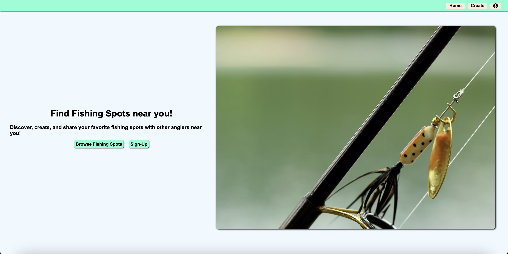
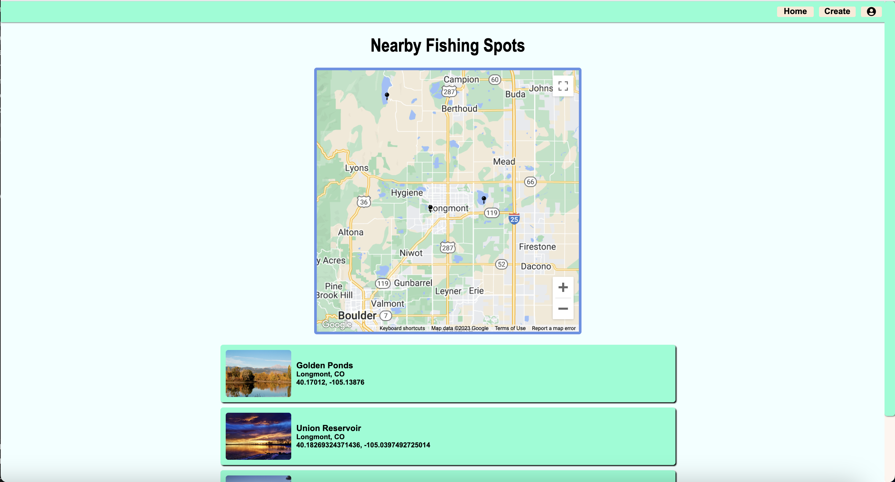
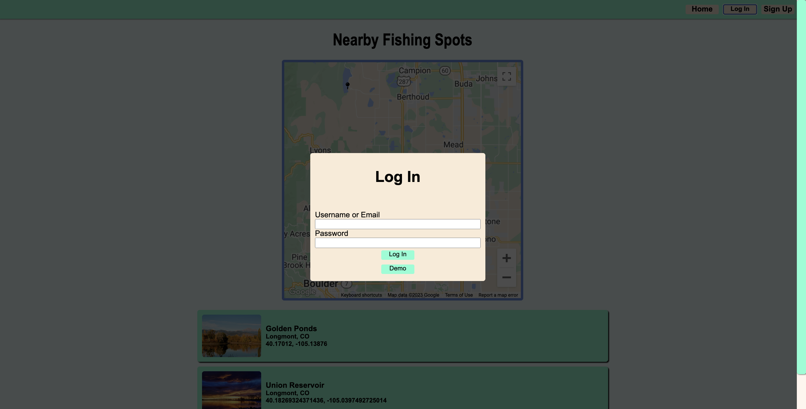
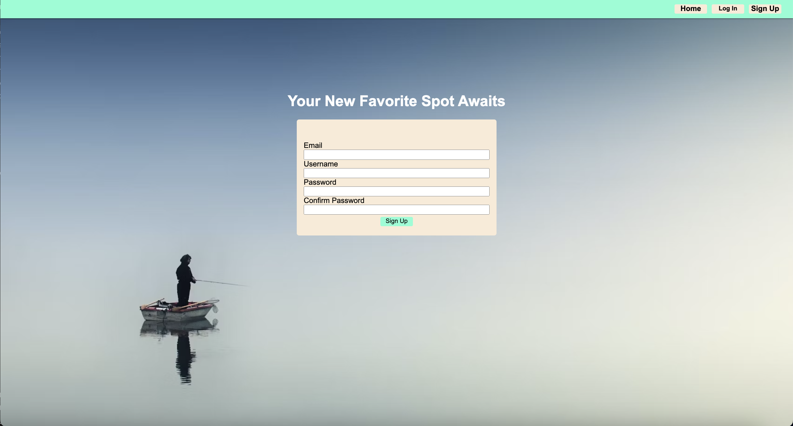
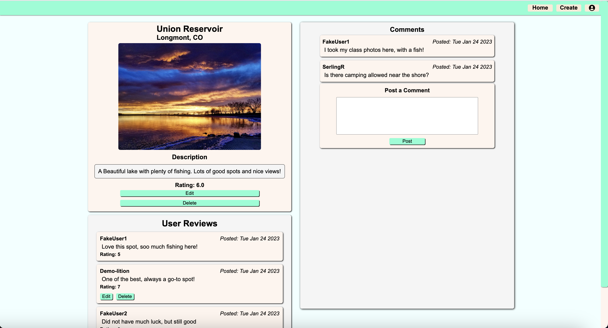
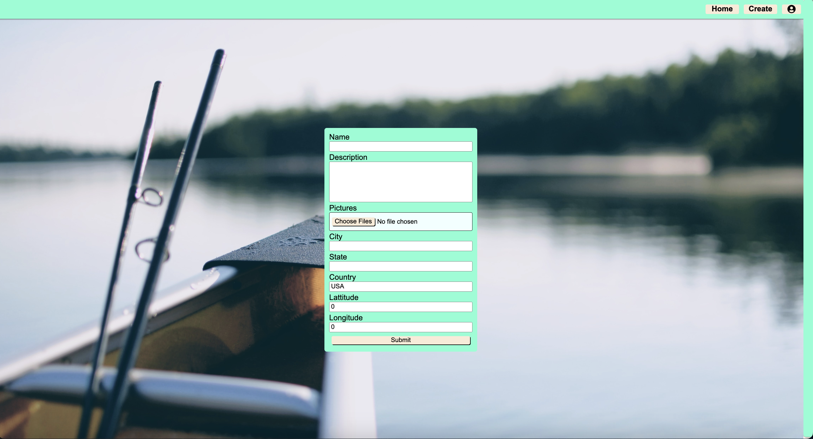

# On-Hook

## Snapshot
----------------------------
On-Hook is a full stack app that allows users to look for fishing spots
in their city or state. Logged in users can favorite fishing spots and
rate them as well. Users can also comment on a specific fishing spot's
page.

Live Link:
[🐟Splash!][site-url]

## Architecture
On-Hook is built using Express.js and Postgres for the backend, and React and Redux for the
Frontend.

## Frontend
[![React][react-shield]][react-url]
[![Redux][redux-shield]][redux-url]
[![AWS][aws-shield]][aws-url]
[![GoogleMaps][maps-shield]][maps-url]

## Backend
[![Postgres][postgres-shield]][posgtres-url]
[![Sequelize][sequelize-shield]][sequelize-url]
[![Express][express-shield]][express-url]

# Feature List

## Fishing Spots
* Styled as a list on the homepage
* Individual page with full information
* Address and location of the spot
* Image of location
* Rating of the fishing spot
* List reviews on individual page
* List of comments on individual page

## Reviews
* Each fishing spot can have one review per user
* User can rate the fishing spot
* Ability to edit reviews
* Ability to delete reviews

## Users
* Can create a user account
* User must supply username, email, password
* Can write reviews as a user
* Can create fishing spots as a user
* Can comment on fishing spots as a user

## Comments
* Users can write multiple comments for a fishing spot
* Users can edit their comments
* Users can delete their comments

## Site Preview
### Splash Page

### Homepage

### Login

### Signup

### Fishing Spot Details

### Fishing Spot Form

[site-url]: https://on-hook.herokuapp.com/

[node-shield]: https://img.shields.io/badge/-NODE-green?style=for-the-badge&logo=nodedotjs
[node-url]: https://nodejs.org/en
[javascript-shield]: https://img.shields.io/badge/JavaScript-323330?style=for-the-badge&logo=javascript&logoColor=F7DF1E
[javascript-url]: https://www.javascript.com/
[html-shield]: https://img.shields.io/badge/HTML5-E34F26?style=for-the-badge&logo=html5&logoColor=white
[html-url]: https://www.w3.org/html/
[css-shield]: https://img.shields.io/badge/CSS-239120?&style=for-the-badge&logo=css3&logoColor=white
[css-url]: https://www.w3.org/Style/CSS/Overview.en.html
[express-shield]: https://img.shields.io/badge/Express.js-404D59?style=for-the-badge&logo=express
[express-url]: https://expressjs.com/en/4x/api.html
[sequelize-shield]: https://img.shields.io/badge/sequelize-323330?style=for-the-badge&logo=sequelize&logoColor=blue
[sequelize-url]: https://sequelize.org/docs/v6/
[postgres-shield]: https://img.shields.io/badge/-POSTGRES-grey?style=for-the-badge&logo=postgresql
[posgtres-url]: https://www.postgresql.org/docs/12/index.html
[react-shield]: https://img.shields.io/badge/-REACT-blue?style=for-the-badge&logo=react
[react-url]: https://react.dev/
[redux-shield]: https://img.shields.io/badge/-REDUX-red?style=for-the-badge&logo=redux
[redux-url]: https://redux.js.org/
[aws-shield]: https://img.shields.io/badge/-AWSS3-yellow?style=for-the-badge&logo=amazonaws
[aws-url]: https://docs.aws.amazon.com/s3/index.html
[maps-shield]: https://img.shields.io/badge/-GOOGLEMAPS-green?style=for-the-badge&logo=googlemaps
[maps-url]: https://developers.google.com/maps/documentation